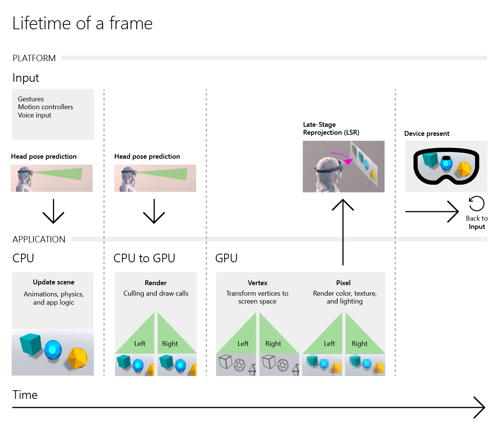

# Core Windows Mixed Reality concepts

This article will give you an overview of the core concepts you should know when developing spatial applications for Windows Mixed Reality devices like HoloLens and immersive (VR) headsets. These concepts enable developers to build innovative experiences, and help address many of the nuances and challenges associated with developing mixed reality applications. 

## Understanding reality

Windows Mixed Reality allows developers to build mixed reality (or 3D spatial) applications using innovative hardware and software to understand the user's physical space. In short, mixed reality is the blending of they physical world with the digital world, and Windows Mixed Reality enables two device types on that spectrum: [Microsoft HoloLens](hololens-hardware-details.md), a holographic computer that blends 3D holograms into the real world, and [immersive (VR) headsets](immersive-headset-hardware-details.md) that transport you into a digital environment while representing your physical movement and position. [Read this article to learn more about the mixed reality spectrum.](mixed-reality.md)

Both device types have multiple sensor components that provide data of the physical environment, which the platform analyzes to surface valuable information to your mixed reality application.

### Head-tracking

<table>
<tr>
<th>Feature</th><th style="width:150px"> <a href="hololens-hardware-details.md">HoloLens</a></th><th style="width:150px"> <a href="immersive-headset-hardware-details.md">Immersive headsets</a></th>
</tr><tr>
<td> Head-tracking</td><td style="text-align: center;">✔️</td><td style="text-align: center;">✔️</td>
</tr>
</table>

Windows Mixed Reality devices track the user's pose in their environment. A pose is a position and orientation that defines where the user is, and where they are looking, in your spatial application.

Need gif/img demonstrating head tracking in space
Visualization of head tracking cameras performing SLAM and tracking user position in a room/space
Effectively, how would you answer "What is Head Tracking" with only an image

In order to calculate an individual's pose, Windows Mixed Reality devices use **inside-out tracking** technology. Every device has multiple hardware sensors that provide data of the physical environment, which the platform analyzes to perform inside-out tracking as a user moves and rotates through their space. The devices are constantly scanning and learning about the physical environment as the user moves and looks from different vantage points. An advantage of inside-out tracking is that the sensors are in the headset, and therefore require no external set up of cameras, lighthouse markers, etc.

Are there pose articles (like pose in Unity) we'd want to link to for further reading?

### Spatial mapping

<table>
<tr>
<th>Feature</th><th style="width:150px"> <a href="hololens-hardware-details.md">HoloLens</a></th><th style="width:150px"> <a href="immersive-headset-hardware-details.md">Immersive headsets</a></th>
</tr><tr>
<td> Spatial mapping</td><td style="text-align: center;"> ✔️</td><td style="text-align: center;"></td>
</tr>
</table>

Using data collected by a best-in-class depth camera module, HoloLens builds a polygonal mesh representative of the physical surfaces in the current environment. This can then be utilized for placing objects (i.e on a wall), occluding holograms (i.e a character behind a couch), and to drive other important simulation models, such as physics and path finding. The surface reconstruction of the physical space, also known as the spatial map, is built gradually over time as HoloLens learns more about the environment. HoloLens can gather new information about the environment as users move and view a space from multiple vantage points. Though HoloLens is always scanning the environment to update spatial mapping data, some developers may choose to incorporate an environment scanning experience, prompting the user to maps out their physical space, before the core application scenarios begin.

[Learn more about the uses of spatial mapping](spatial-mapping.md) | [Learn how to design effectively for spatial mapping](spatial-mapping-design.md)

## Understanding interactions

Mixed reality apps offer new interaction models compared to traditional application design. This section will introduce some of these new mixed reality input concepts. In particular, these interaction models can become exceedingly powerful when leveraged together.

### [Gaze](gaze.md)

<table>
<tr>
<th>Feature</th><th style="width:150px"> <a href="hololens-hardware-details.md">HoloLens</a></th><th style="width:150px"> <a href="immersive-headset-hardware-details.md">Immersive headsets</a></th>
</tr><tr>
<td> Gaze </td><td style="text-align: center;">✔️</td><td style="text-align: center;">✔️</td>
</tr>
</table>

Since Windows Mixed Reality devices can understand where a user is positioned and in which direction they are looking, developers can leverage gaze to interact with their application. By drawing a line from the user's head position along the line of their view, a developer can identify towards which holograms and UI the user is currently gazing. Gaze generally acts the *cursor* for the user in mixed reality apps. Gaze, in conjunction with other input and/or app information, can lead to powerful interactions. For example, a user may target a hologram with their gaze and say "hide that" to hide the hologram. With gaze, your application is able to know which hologram the user is referencing with their command.

[Learn more about gaze](gaze.md) | [Learn how to design effectively for gaze](gaze-targeting.md)

### [Gestures](gestures.md) and [motion controllers](motion-controllers.md)

<table>
<tr>
<th>Feature</th><th style="width:150px"> <a href="hololens-hardware-details.md">HoloLens</a></th><th style="width:150px"> <a href="immersive-headset-hardware-details.md">Immersive headsets</a></th>
</tr><tr>
<td> Gestures </td><td style="text-align: center;">✔️</td><td style="text-align: center;"></td>
</tr><tr>
<td> motion controllers </td><td style="text-align: center;"></td><td style="text-align: center;">✔️</td>
</tr>
</table>

Users want to interact with and nimbly control their content in mixed reality. Gestures and motion controllers are the primary means for users to interact with content in your app using their *hands*. Which input method you leverage depends on the device endpoint being targeted. Gestures are used for HoloLens and motion controllers are used for immersive (VR) headsets. 

The platform recognizes a predefined set of hand gestures and motion controller buttons. However, developers are also given the capability to track the position of each. This *hand position* can be used to control UI or track the intended movement objects, such as dragging a selection through space.

 
*An example of a gesture, "bloom" brings up the Start or quick action menu* 

 
*Diagram of motion controller* 

[Learn more about gestures on HoloLens](gestures.md) | [Learn more about motion controllers](motion-controllers.md)

### [Voice input](voice-input.md)

<table>
<tr>
<th>Feature</th><th style="width:150px"> <a href="hololens-hardware-details.md">HoloLens</a></th><th style="width:150px"> <a href="immersive-headset-hardware-details.md">Immersive headsets</a></th>
</tr><tr>
<td> Voice input</td><td style="text-align: center;"> ✔️</td><td style="text-align: center;"> ✔️ (with microphone)</td>
</tr>
</table>

The Windows Mixed Reality platform can understand simple verbal commands and keywords. Alongside gaze, gestures, and motion controllers, voice is another form of core input enabling users to take action in mixed reality. For some scenarios, voice is a more efficient means of input and communicating intent. For example, when combined with gaze, users can more easily delete a hologram using voice than trying to target and select delete UI via gestures or motion controllers. 

[Learn more about voice input methods](voice-input.md) | [Learn more about designing for voice input](voice-design.md)

### [Spatial sound](spatial-sound.md)

<table>
<tr>
<th>Feature</th><th style="width:150px"> <a href="hololens-hardware-details.md">HoloLens</a></th><th style="width:150px"> <a href="immersive-headset-hardware-details.md">Immersive headsets</a></th>
</tr><tr>
<td> Spatial sound</td><td style="text-align: center;"> ✔️</td><td style="text-align: center;"> ✔️ (with headphones)</td>
</tr>
</table>

To ensure a true spatial experience, the Windows Mixed Reality platform simulates 3D sound, allowing users to understand direction and distance of holograms and UI in their space by the sounds they produce. Spatial sound conveys the sense of 3D position for holograms and activity in a mixed reality application. For example, a developer can redirect a user's attention to look behind them by playing audio from a hologram behind the user.

[Learn more about spatial sound](spatial-sound.md) | [Learn more about designing for spatial sound](spatial-sound-design.md)

## Understanding your app runtime

Mixed reality applications behave very similarly to game runtime dynamics. Your application will process input, update current state and perform app-specific computations, and then render an image to be presented to the user. This process will then loop continuously for the lifetime of your program.

The ultimate goal of your application every iteration in this loop is to calculate an image to present to the user. In order to do this correctly, the Windows Mixed Reality platform provides accurate input information to your app to ensure your scene is rendered correctly. Further, the Windows Mixed Reality platform has to track various inputs and make them available to your application.

The end-to-end process of creating an image takes time. If an application runs at 60 frames-per-second, which means 60 images are rendered and presented to the user per second, then an application is finishing an image every 16.6 milliseconds.

As noted below, the Windows Mixed Reality platform provides multiple predictions for where the current user is located and where they are looking. Further, the platform will perform a process known as Late-Stage Reprojection (LSR) that adjusts the final rendered image for the current camera prediction before presenting on device.

Multiple pose predictions are provided over time because a user's head will move, even if it's just slightly, throughout the entire time period from CPU to device present. This process is largely abstracted in development environments such as Unity.

However, it is important to understand that, unlike traditional development, the user is the camera and Windows Mixed Reality adapts to solving the unique problems related to that.

 
*Lifetime of a frame*

## See Also
- [Critical concepts to ensure optimal user experience](ensure-optimal-user-experience.md)
- [Hologram stability](hologram-stability.md)
- [Unity development overview](unity-development-overview.md)
